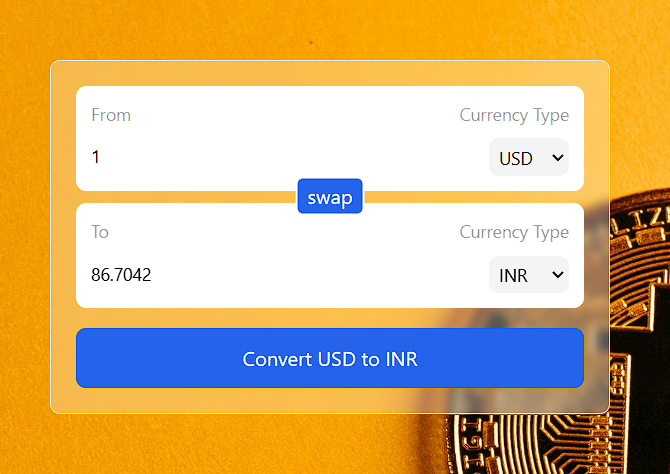
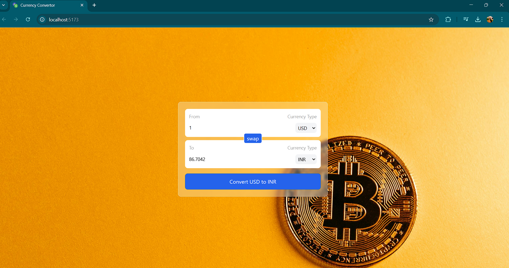

# Currency Converter Web App

A simple currency converter web application that allows users to convert between different currencies using real-time exchange rates.

## Features
- 🌍 Convert between multiple currencies.
- 🔄 Swap between "From" and "To" currencies.
- 📡 Fetches real-time exchange rates via an API.
- 🎨 Responsive and user-friendly UI.
- 📌 Default currencies: USD (From) → INR (To).

## Tech Stack
- **Frontend**: React.js, Tailwind CSS
- **State Management**: useState, useEffect
- **API**: [ExchangeRate-API](https://v6.exchangerate-api.com/v6/794c5b5fdb42ec8e97eb113b/latest/${currency})
- **Build Tool**: Vite

## Live Demo
🚀 The project is live at: [Currency Converter](https://currency-convertor-zeta-orpin.vercel.app/)

## Installation & Setup
### Prerequisites
- Node.js & npm installed.

### Steps
1. **Clone the repository**
   ```sh
   git clone https://github.com/aastha-sin-09/currency-converter.git
   cd currency-converter
   ```

2. **Install dependencies**
   ```sh
   npm install
   ```

3. **Start the development server**
   ```sh
   npm run dev
   ```

4. **Open the app in your browser**
   ```
   http://localhost:5173
   ```

## File Structure
```
📚 currency-converter/
├── 📂 public/        # Static assets (logo)
├── 📂 src/
│   ├── 📂 assets/    # Images & assets
│   ├── 📂 components/# Reusable UI components (InputBox, etc.)
│   ├── 📂 hooks/     # Custom hooks (useCurrencyInfo)
│   ├── 📄 App.jsx    # Main application
│   ├── 📄 index.js   # Entry point
│   ├── 📄 main.jsx   # Renders React app
│   ├── 📄 styles.css # Tailwind styles
├── 📄 package.json   # Dependencies & scripts
├── 📄 README.md      # Project documentation
```

## Usage
1. **Enter the amount** in the input box.
2. **Select currencies** from dropdowns.
3. Click **Convert** to get the exchange rate.
4. Click **Swap** to switch between currencies.

## API Configuration
The app fetches real-time currency exchange rates using the following API:
```js
fetch(`https://v6.exchangerate-api.com/v6/794c5b5fdb42ec8e97eb113b/latest/${currency}`)
```
No API key is required.

## Screenshots
### Preview of the application



## Troubleshooting
- If the **favicon doesn't update**, clear the cache and restart the server (`Ctrl+Shift+R`).
- If API calls **fail**, check the API status or use an alternative API.

## Contributors
- **Aastha Singh** - [GitHub Profile](https://github.com/aastha-sin-09)

---
🚀 Happy Coding!

