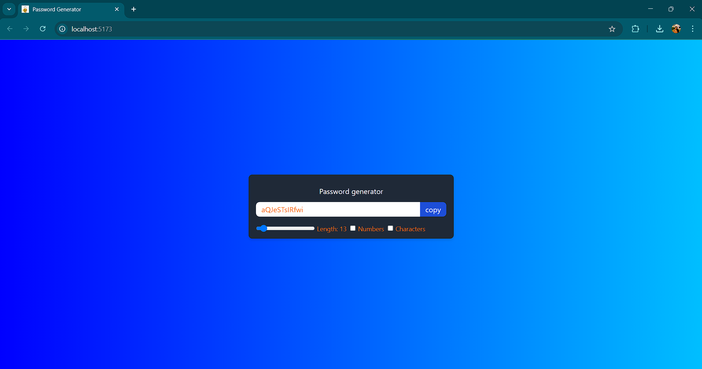
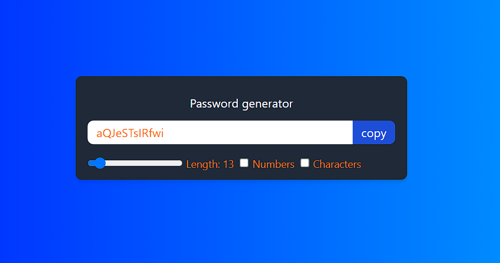

# 🔑 Password Generator

A simple and secure password generator built with **React.js** and **Tailwind CSS**.

## 🌐 Live Demo
🔗 [Password Generator](https://password-generator-one-mauve.vercel.app/)

## 📸 Screenshots

### Password Generator Interface:


### Password Options:



## 🚀 Features
- ✅ Generate secure passwords with adjustable length.
- 🔢 Include numbers and special characters as per user preference.
- 📋 One-click password copy to clipboard.
- 🎨 Stylish UI with Tailwind CSS.

## 🛠️ Technologies Used
- **React.js** ⚛️
- **Vite** ⚡
- **Tailwind CSS** 🎨
- **JavaScript (ES6+)** 🟨

## 📂 Project Structure

```
Password_Generator/
│── public/
│   ├── logoP.png
│── src/
│   ├── assets/
│   │   ├── preview1.png
│   │   ├── preview2.png
│   ├── App.css
│   ├── App.jsx
│   ├── index.css
│   ├── main.jsx
│── .gitignore
│── eslint.config.js
│── index.html
│── package-lock.json
│── package.json
│── postcss.config.js
│── README.md
│── tailwind.config.js
│── vite.config.js
```

## 📦 Installation & Setup

1. **Clone the repository:**
   ```sh
   git clone https://github.com/aastha-sin-09/password-generator.git
   cd password-generator
   ```

2. **Install dependencies:**
   ```sh
   npm install
   ```

3. **Run the development server:**
   ```sh
   npm run dev
   ```

4. Open your browser and go to `http://localhost:5173`

## 📜 License
This project is open-source and available under the [MIT License](LICENSE).

---

🔗 **GitHub**: [@aastha-sin-09](https://github.com/aastha-sin-09)

